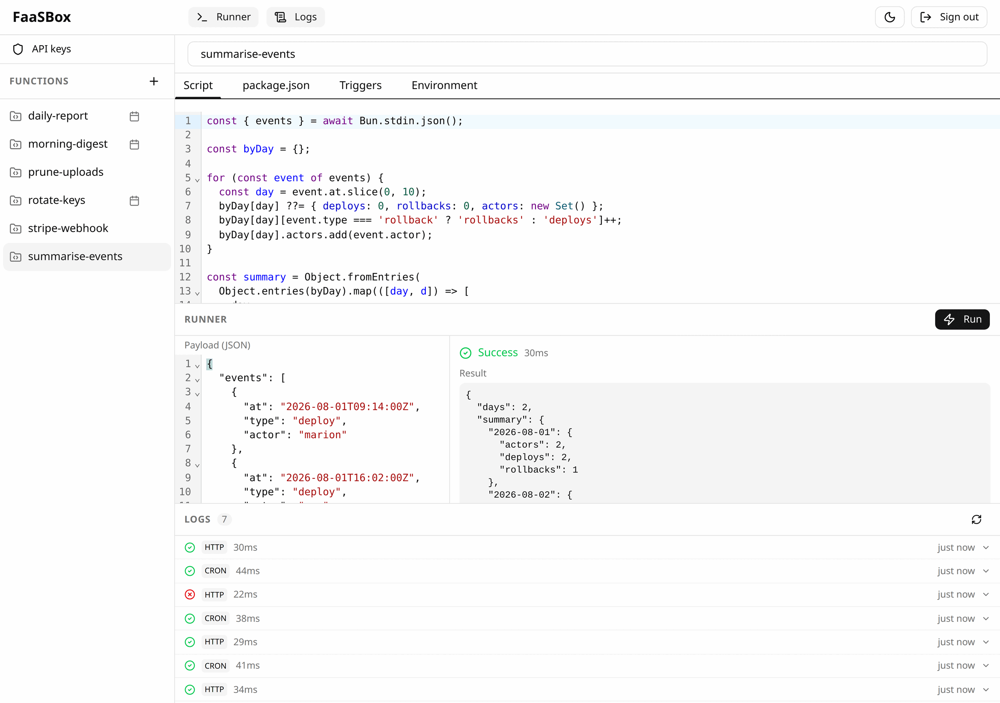

# 🚀 FaaSBox

[](https://github.com/AntoineViau/FaaSBox/actions/workflows/ci.yml)

**[faasbox.net](https://faasbox.net)** · **FaaSBox** is a lightweight, self-hosted **Functions-as-a-Service** platform built on top of [PocketBase](https://pocketbase.io/) and [Bun](https://bun.sh/). 

It allows you to write TypeScript/JavaScript functions, deploy them instantly, invoke them via HTTP with hashed API keys, or schedule them using a flexible cron system. Code, dependencies, secrets, schedules and execution logs are all managed from the built-in editor, with the PocketBase admin UI underneath for direct access to the underlying collections.

Under the hood: **Go** and **PocketBase** for the server, **Bun** for function execution, **Angular** for the editor, **SQLite** for everything stored. See [08 - Architecture Deep Dive](docs/08-architecture-deep-dive.md) for how the pieces fit together.

<!-- GitHub honours prefers-color-scheme here, so the capture follows the
     reader's theme instead of glaring at half of them. -->
<picture>
  <source media="(prefers-color-scheme: dark)" srcset="site/assets/shots/editor-full-dark.png">
  
</picture>

---

## ⚡ Quick Start

### 1. Run with Docker
```bash
docker build -f infra/production/Dockerfile -t faasbox .

docker run -d -p 8080:8080 \
  -e SUPERUSER_EMAIL=admin@example.com \
  -e SUPERUSER_PASSWORD=yourpassword \
  -e FAASBOX_ENCRYPTION_KEY=$(openssl rand -hex 32) \
  -e FAASBOX_MAX_CONCURRENCY=4 \
  -v faasbox-data:/app/data/pb_data \
  faasbox
```

### 2. Run locally (without Docker)

Requires **Go 1.24+**, **Bun**, and **Node.js** (for the Angular build).

```bash
# All-in-one: builds the UI then starts the Go server
bash infra/dev/dev.sh
```

It keeps a development encryption key in `data/pb_data/.faasbox-dev-key` and reuses it on the next run, so secrets written in one session are still readable in the next. Export `FAASBOX_ENCRYPTION_KEY` yourself to override it.

Or step by step:

```bash
# Build the Angular editor
cd ui && npm install && npm run build && cd ..

# Start the server (without a key, secrets are disabled — the server only warns)
export FAASBOX_ENCRYPTION_KEY=$(openssl rand -hex 32)
cd server && go run . serve --http=127.0.0.1:8080 --dir=../data/pb_data
```

A key that changes between two runs leaves the secrets written by the previous one unreadable: the editor's **Environment** tab then answers `500`, on purpose, rather than showing an empty set you would overwrite.

Then open `http://localhost:8080/_/` to create your superuser account on first launch.

### 3. Access the UI
- **Editor UI**: `http://localhost:8080/` — where you work: write and test functions, schedule them, set their secrets, manage API keys and read execution logs.
- **Admin UI**: `http://localhost:8080/_/` — the PocketBase dashboard underneath, for the raw collections, backups and server settings.

### 4. Create an API Key

The editor has an **API keys** page (button in the header) that creates, scopes, disables and deletes keys, and reveals the raw value once. To do it from the shell instead:

```bash
# 1. Get a token
TOKEN=$(curl -s -X POST http://localhost:8080/api/collections/_superusers/auth-with-password \
  -H 'Content-Type: application/json' \
  -d '{"identity":"admin@example.com","password":"yourpassword"}' | jq -r '.token')

# 2. Create a key
curl -s -X POST http://localhost:8080/api/faasbox/keys \
  -H "Authorization: $TOKEN" \
  -H 'Content-Type: application/json' \
  -d '{"name":"my-app","allowedFunctions":["*"]}'
```

### 5. Invoke a Function
```bash
curl -X POST http://localhost:8080/invoke/echo \
  -H "X-API-Key: YOUR_API_KEY" \
  -H "Content-Type: application/json" \
  -d '{"hello": "world"}'
```

---

## 🔒 Security Highlights

- **Hashed API Keys**: Only SHA-256 hashes of API keys are stored.
- **Encrypted Secrets**: Custom env vars are encrypted at rest using AES-256-GCM.
- **Isolated Runtimes**: Functions run in ephemeral subprocesses with minimal environments.
- **Non-Root Execution**: The Docker container runs as a dedicated `faas` user.

Found a vulnerability? **Do not open a public issue.** Report it privately — see [SECURITY.md](SECURITY.md) for the channel, the expected response time, and what is in or out of scope.

---

## 📑 Full Documentation

- [**00 - Introduction**](docs/00-introduction.md)
- [**01 - Concepts**](docs/01-concepts.md)
- [**02 - Getting Started**](docs/02-getting-started.md)
- [**03 - Writing Functions**](docs/03-writing-functions.md)
- [**04 - Environment Variables**](docs/04-environment-variables.md)
- [**05 - Scheduling (Cron)**](docs/05-scheduling-cron.md)
- [**06 - API Keys & Security**](docs/06-api-keys-and-security.md)
- [**07 - Execution Logs**](docs/07-execution-logs.md)
- [**08 - Architecture Deep Dive**](docs/08-architecture-deep-dive.md)
- [**09 - API Reference**](docs/09-api-reference.md)
- [**10 - Deployment**](docs/10-deployment.md)
- [**11 - Development Guide**](docs/11-development-guide.md)

---

Built with ❤️ using **Go**, **PocketBase**, **Bun**, and **Angular**.
