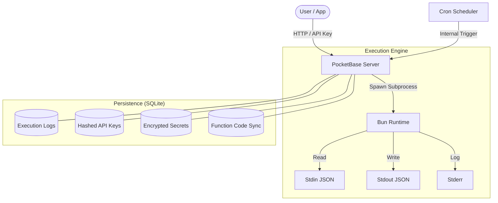

# 08 - Architecture Deep Dive

This document explains the technical implementation of FaaSBox for developers and curious users.

## The Stack

- **Language**: [Go](https://go.dev/) (for the server)
- **Framework**: [PocketBase](https://pocketbase.io/) (Auth, DB, Router, UI)
- **Runtime**: [Bun](https://bun.sh/) (Function execution)
- **Frontend**: [Angular](https://angular.dev/) (Editor & Runner)
- **Database**: [SQLite](https://www.sqlite.org/) (Embedded via PocketBase)

FaaSBox integrates all of it into a single binary, shipped as a single container:



## Component Overview

### 1. The Go Server (`faasbox`)
The Go binary is the orchestrator. It extends PocketBase with custom routes and hooks:
- **API Key Middleware**: Validates the `X-API-Key` header by hashing the input and comparing it with stored hashes.
- **Execution Engine**: Manages the spawning of Bun subprocesses, pipes stdin/stdout, and handles timeouts.
- **Cron Sync**: A background task that syncs DB records with the internal Go cron scheduler.
- **Encryption at rest**: Handles AES-256-GCM encryption of everything the database holds of your work, and decryption on the way back out. See below.

### 2. What the Database Actually Holds
The SQLite file is what Litestream replicates to your S3 bucket and what you restore elsewhere, so what it holds in the clear is what a copy of it gives away.

Encrypted with `FAASBOX_ENCRYPTION_KEY`, per column: your function code, its `package.json` and lockfile, the output of its dependency install, the name, schedule and payload of each trigger, the three output fields of every execution, the label and visible prefix of each API key, and the name and redirect URLs of each authorized agent. The key never encrypts anything directly — a subkey is derived from it by HKDF-SHA256, under a label of its own.

Two things are deliberately **not** encrypted. **Hashes** stay hashes — the SHA-256 of an API key, and the token fingerprints of an agent: encrypting one would turn the database plus the key back into a usable credential. And a handful of columns are **queried in SQL** — the name of a function, the identifier of an OAuth client — which no ciphertext survives.

Neither is the shape of it: how many functions there are, when each was created and modified, how many times each ran, with what status, for how long, with what exit code, and roughly how large each encrypted value is. Column-level encryption does not go below that floor. If that matters for where your backups live, encrypt the replica itself.

The server decrypts for the responses it serves and for its own reads; nothing is ever written back in the clear.

### 3. The Execution Flow
When `/invoke/{name}` is called:
1.  **Auth**: Middleware checks the API key, and its scope if it has one.
2.  **Read**: Reads the request body, refusing anything past the body limit.
3.  **Admit**: Takes a slot in the global concurrency semaphore, or answers `429` straight away rather than queueing.
4.  **Resolve**: Reads the one function record the path segment designates — by id or by name. Everything the rest of the flow needs comes off that row: the **id**, which names the directory on disk, the **name**, and the **encrypted secrets**. An unknown segment stops here with a `404`, and nothing is recorded because nothing ran.
5.  **Secrets**: Decrypts the `env` blob carried by the record just read. No second lookup.
6.  **Lookup**: Verifies that the function's `index.ts` exists on disk.
7.  **Dependencies**: `deps.go` checks whether `node_modules` matches the current spec. It normally does — the install already ran when the function was saved — so this is a fingerprint comparison and nothing more.
8.  **Spawn**: Starts `bun run` on the function's `index.ts`, with the functions root as the working directory.
9.  **Pipe**: Writes the HTTP request body to the subprocess's `stdin`.
10. **Monitor**: Waits for the process to finish or hit a 30s timeout. On timeout, the entire process group is killed (not just the main process), preventing zombie subprocesses.
11. **Record**: Saves the result, duration, and logs to `faasbox_logs`.
12. **Respond**: Returns the JSON result to the client.

### 4. Dependency Installation
Installing happens when a function is **saved**, in the background: the save returns straight away, and the `depsStatus` field on the record reports where the install stands.

**At startup**, a second background pass covers what a save cannot see: `node_modules` is not part of what the database restores, so a rebuilt filesystem has none. The pass walks the functions, skips those whose fingerprint already matches, and installs the rest one at a time — serialised, because installing them all at once would multiply the memory peak by their number. It is detached from startup, so the server listens without waiting for it.

The invocation path keeps its own check as a last resort, for what both miss — a `node_modules` removed by hand, or a startup install that failed.

To prevent race conditions where a background install and an invocation try to run `bun install` at the same time, we use a global Go `sync.Map` of mutexes. One mutex per function directory: the second caller waits for the first, then finds the work already done.

### 5. Output Truncation
Truncation happens twice, for two different reasons.

- **To protect the server's memory**, a `LimitedWriter` captures only the first 1 MB of `stdout` and `stderr` — per stream, and adjustable via `FAASBOX_MAX_OUTPUT_SIZE`. Writes past that point are discarded and the response carries a `truncated` flag.
- **To protect the database**, the copy written to `faasbox_logs` is cut much lower — 8 KB per stream and 4 KB for the request payload — with a marker stating the original size. Without this second cap, a single log row could weigh 21 MB, and SQLite never gives disk back once the file has grown.

The HTTP response is built from the captured output, not from the log record, so it always carries the full capture.

The first cap has a consequence the flag alone does not convey: when the cut lands mid-JSON, the surviving fragment is not a result. The invocation path tracks `stdout` truncation separately from the combined flag and refuses that case with a `502` rather than returning the fragment as a plain string. The cron path does not parse output at all, so it keeps recording whatever it captured.

### 6. The Built-in Editor
The editor is a standalone Angular Single Page Application (SPA).
- **Location**: Built into `data/pb_public/`.
- **Communication**: It uses the PocketBase SDK and custom FaaS endpoints.
- **Features**: Code editing (via CodeMirror), real-time invocation, and log viewing.

## Database-to-Disk Synchronization

The **database is the source of truth** for function code. The `faasbox_functions` collection stores each function's `script` (the `index.ts` content) and `packageJson`, encrypted. The file system is a derived copy, rebuilt automatically — and written in the clear, since that is what Bun compiles. An empty field removes its file rather than writing an empty one.

### Startup Sync

When the server starts, `syncDiskFromDB` reads every record from `faasbox_functions` and writes the corresponding `index.ts` (and `package.json` and `bun.lock` if present) to the `functions/` directory. This ensures the file system is always consistent after a container restart or redeployment — even if the `functions/` directory was empty. The dependency pass described above then runs on the files it just restored.

### Live Sync via Hooks

PocketBase hooks keep the disk in sync in real time as records change:

- **Create / Update** (`OnRecordAfterCreateSuccess`, `OnRecordAfterUpdateSuccess`): writes the function files to disk immediately.
- **Delete** (`OnRecordAfterDeleteSuccess`): removes the function directory from disk.

This means you never need to manage files manually. Whether you edit code in the Editor, create a function via the API, or modify a record in the Admin UI, the disk is updated instantly.

## File System Structure (Inside Container)

```text
/app/
├── faasbox              # The compiled Go binary
├── functions/           # The folder containing your TypeScript code
│   └── k9m2xq7p4wz1n3v/
│       ├── index.ts
│       └── package.json
└── data/
    ├── pb_data/         # Persistent SQLite database & settings
    └── pb_public/       # Static files for the Editor (the Admin UI is embedded in the binary)
```

Those directory names are **record ids**, not function names — which is why a shell in the container shows `k9m2xq7p4wz1n3v/` where you expected `my-func/`. An id never changes, so renaming a function leaves its directory and its `node_modules` exactly where they are, and no path is ever built from a string a user can edit. To find a function's directory, read its id in the `faasbox_functions` collection.

## Compilation & Build
The Go binary is compiled with hardening flags:
- `-trimpath`: Removes local file paths from the binary.
- `-ldflags="-s -w"`: Strips debug information and symbol tables.
- `CGO_ENABLED=0`: Produces a static binary for maximum portability.
